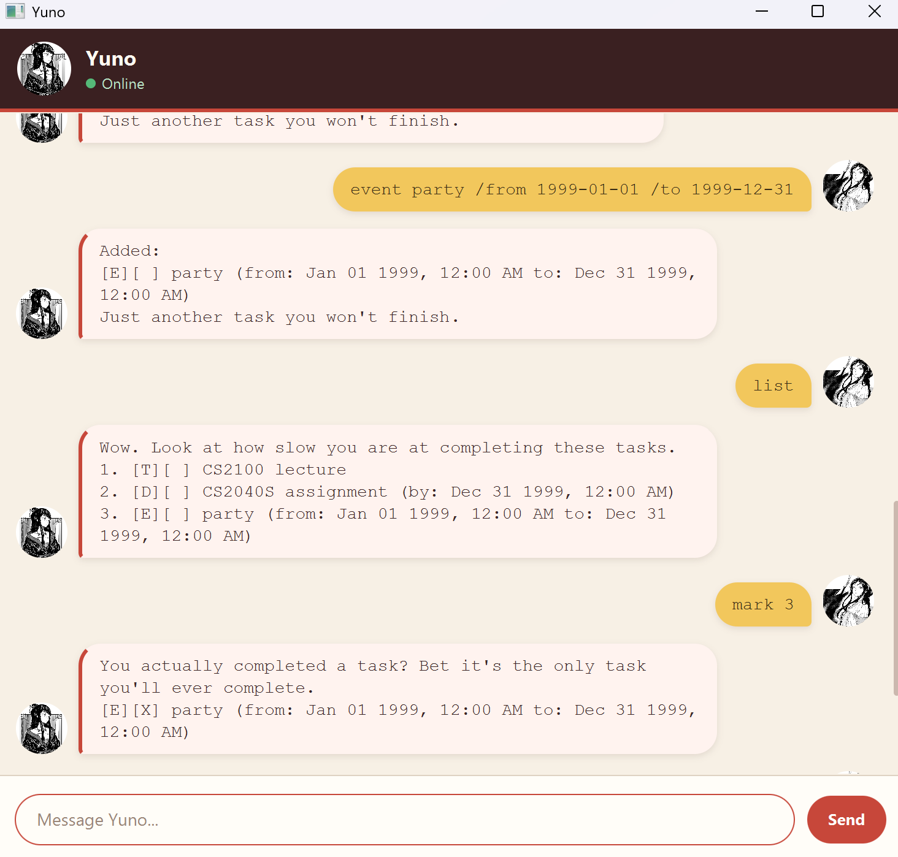

# Yuno User Guide

Yuno is a desktop task manager that helps you record, find, and organise your
tasks—with a little impatience along the way.

## Quick start

1. Install **Java 25**.
2. Place `yuno.jar` in a folder of your choice.
3. Open a terminal in that folder and run `java -jar yuno.jar`.
4. Type a command in the message box, then press <kbd>Enter</kbd> or click
   **Send**.

Enter `help` at any time to see the command formats inside Yuno.

## Reading this guide

- Words in angle brackets, such as `<description>`, are values for you to
  replace. Do not type the angle brackets.
- Task numbers are shown by `list` and can change after deleting or sorting
  tasks.
- Dates use `yyyy-MM-dd` or `yyyy-MM-dd HHmm`, for example `2026-09-30` or
  `2026-09-30 1830`.
- A date without a time is treated as midnight at the start of that date.

## Command summary

| Action | Command |
| --- | --- |
| Add a to-do | `todo <description>` |
| Add a deadline | `deadline <description> /by <date or date-time>` |
| Add an event | `event <description> /from <date or date-time> /to <date or date-time>` |
| Show all tasks | `list` |
| Mark a task complete | `mark <task number>` |
| Mark a task incomplete | `unmark <task number>` |
| Delete a task | `delete <task number>` |
| Delete all tasks | `clear` |
| Find tasks by description | `find <text>` |
| Find tasks relevant to a date | `find /date <yyyy-MM-dd>` |
| Sort tasks from earliest to latest | `sort` or `sort /order asc` |
| Sort tasks from latest to earliest | `sort /order desc` |
| Show help | `help` |
| Exit Yuno | `bye` |

## Adding tasks

### To-dos

Use `todo` for a task without a date.

Example: `todo read CS2103T textbook`

### Deadlines

Use `deadline` for a task that must be completed by a particular date or time.

Example: `deadline submit assignment /by 2026-09-30 2359`

### Events

Use `event` for an activity with a start and end. The end must be later than
the start.

Example:
`event project meeting /from 2026-09-30 1400 /to 2026-09-30 1600`

Yuno displays `[T]`, `[D]`, or `[E]` beside to-dos, deadlines, and events.
`[ ]` means incomplete, while `[X]` means complete.

## Managing tasks

Use `list` before a numbered command to check the latest task numbers.

- `mark 2` marks task 2 as complete.
- `unmark 2` marks task 2 as incomplete again.
- `delete 2` permanently removes task 2.
- `clear` permanently removes every task.

## Finding tasks

Use `find <text>` to find tasks whose descriptions contain that text.

Example: `find project`

Use `find /date <yyyy-MM-dd>` to find tasks relevant to a date. The results
include undated to-dos, deadlines due on or before that date, and events that
take place across that date.

Example: `find /date 2026-09-30`

Finding tasks only displays matches; it does not change their task numbers or
saved order.

## Sorting tasks

Use `sort` or `sort /order asc` to place dated tasks from earliest to latest.
Use `sort /order desc` to reverse the dated-task order.

Deadlines are ordered by their due time and events by their start time. To-dos
have no date, so they stay after all dated tasks. Tasks with the same time keep
their existing relative order.

Sorting permanently changes the displayed task numbers and saved task order.

## Saving and exiting

Yuno automatically saves changes to `data/yuno.txt` and loads them the next
time it starts. Avoid editing this file manually because invalid data can stop
Yuno from loading your tasks.

Enter `bye` to exit Yuno. The window closes after Yuno's farewell message.

## If Yuno rejects a command

Check that:

- the command keyword is lowercase and spelled correctly;
- every required description, task number, and date is present;
- command markers such as `/by`, `/from`, `/to`, `/date`, and `/order` are in
  the documented positions;
- dates are real calendar dates in one of the supported formats; and
- an event ends after it starts.

Yuno will display an error instead of changing your saved task list when a
command cannot be completed.
